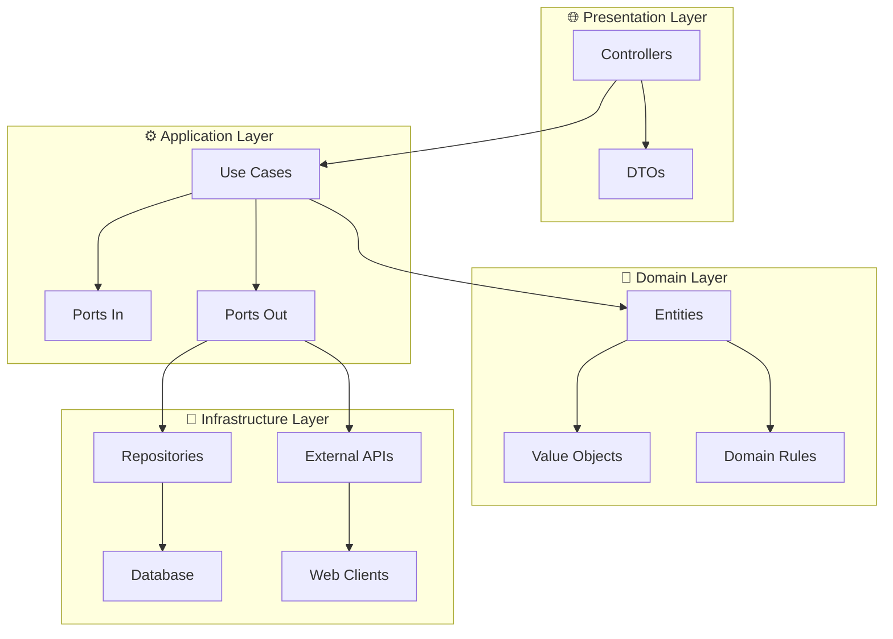

# 🚀 SENAI API - Plataforma de Projetos Acadêmicos

<div align="center">
  
  
  
  
  
</div>

---

## 📋 Sobre o Projeto

Esta API RESTful faz parte de uma **plataforma web educacional** do SENAI que permite aos alunos:

- 📝 **Cadastrar e gerenciar projetos acadêmicos**
- 🔗 **Compartilhar projetos com links e recursos**  
- 👥 **Colaborar com outros alunos**
- 🏢 **Atrair investimento de empresas**
- 🎯 **Controlar visibilidade** (público/privado)

### 🏗️ Arquitetura
Implementa uma **arquitetura híbrida** combinando:
- **n-Layer Architecture** (Presentation, Service, Repository)
- **Clean Architecture** (Entities, Use Cases, Interface Adapters)
- **Hexagonal Architecture** (Ports & Adapters)

---

## 🛠️ Tecnologias Utilizadas

| Categoria | Tecnologia | Versão |
|-----------|------------|--------|
| **Backend** | Java | 21 |
| **Framework** | Spring Boot | 3.1.2 |
| **Build Tool** | Maven | 3.9.5 |
| **ORM** | Hibernate/JPA | 6.2.6 |
| **Database** | PostgreSQL | Latest |
| **Security** | Spring Security + OAuth2 | 3.1.2 |
| **Documentation** | MapStruct | 1.5.3 |
| **Code Generation** | Lombok | 1.18.34 |

---

## 📁 Estrutura do Projeto

```bash
📦 SENAI-API/
├── 📁 .mvn/wrapper/          # Maven Wrapper files
├── 📁 .vscode/               # VS Code configurations
│   ├── extensions.json       # Recommended extensions
│   ├── settings.json         # Workspace settings  
│   └── launch.json          # Debug configurations
├── 📁 docs/                  # Documentation
│   └── vscode-setup.md       # VS Code setup guide
├── 📁 src/
│   └── 📁 main/
│       ├── 📁 java/com/exemplo/meuapp/
│       │   ├── 📁 presentation/     # 🌐 REST Controllers & DTOs
│       │   ├── 📁 application/      # ⚙️ Use Cases & Business Logic
│       │   ├── 📁 domain/          # 🎯 Entities & Business Rules
│       │   ├── 📁 infrastructure/   # 🔧 Database & External APIs
│       │   └── 📁 common/          # 🔄 Mappers & Utils
│       └── 📁 resources/
│           ├── application.yml      # Spring Boot config
│           ├── 📁 static/          # Static files
│           └── 📁 db/              # Database scripts
├── 📁 target/                # Build output (ignored)
├── .gitignore               # Git ignore rules
├── mvnw                     # Maven Wrapper (Unix)
├── mvnw.cmd                # Maven Wrapper (Windows)
├── pom.xml                 # Maven dependencies
└── README.md               # This file
```

---

## ⚡ Quick Start

### 🔧 Pré-requisitos

- ☕ **Java 21** ou superior ([Download JDK](https://adoptium.net/))
- 🎯 **VS Code** ([Download](https://code.visualstudio.com/))
- 🐘 **PostgreSQL** (opcional - H2 embarcado disponível)

### 🚀 Executando o Projeto

#### Opção 1: Via Maven Wrapper (Recomendado)
```bash
# Clone o repositório
git clone <repository-url>
cd SENAI-API

# Execute o projeto
./mvnw spring-boot:run

# No Windows PowerShell:
.\mvnw.cmd spring-boot:run
```

#### Opção 2: Via VS Code
1. Abra o projeto no VS Code
2. Instale as extensões recomendadas (popup automático)
3. Pressione `F5` para debug ou `Ctrl+F5` para executar

#### Opção 3: Compilar JAR
```bash
# Gerar JAR executável
./mvnw clean package

# Executar JAR
java -jar target/meuapp-0.0.1-SNAPSHOT.jar
```

### 🌐 Acessando a Aplicação

Após iniciar, a aplicação estará disponível em:
- **URL**: `http://localhost:8080`
- **📚 Swagger UI**: `http://localhost:8080/swagger-ui.html` ⭐
- **📋 OpenAPI JSON**: `http://localhost:8080/api-docs`
- **📄 OpenAPI YAML**: `http://localhost:8080/api-docs.yaml`
- **❤️ Health Check**: `http://localhost:8080/api/v1/demo/health`

---

## 📚 Documentação da API (Swagger)

### 🎯 **O que é o Swagger?**

O **Swagger** (agora **OpenAPI 3**) é uma ferramenta que gera automaticamente:
- 📖 **Documentação interativa** da sua API
- 🧪 **Interface de testes** para todos os endpoints
- 📋 **Especificação OpenAPI** em JSON/YAML
- 🔄 **Geração de clientes** em várias linguagens

### 🚀 **Como acessar:**

1. **Execute a aplicação**:
   ```bash
   ./mvnw spring-boot:run
   ```

2. **Abra o Swagger UI** no navegador:
   ```
   http://localhost:8080/swagger-ui.html
   ```

### 🎨 **Funcionalidades do Swagger UI:**

- **📖 Documentação automática** de todos os endpoints
- **🧪 Teste direto** dos endpoints no navegador
- **📋 Esquemas** de request/response
- **🔒 Autenticação JWT** integrada
- **📱 Responsivo** para mobile/desktop
- **🎨 Interface moderna** e intuitiva

### 🛠️ **Configurações aplicadas:**

```yaml
# application.yml
springdoc:
  api-docs:
    enabled: true
    path: /api-docs
  swagger-ui:
    enabled: true
    path: /swagger-ui.html
    operationsSorter: method
    tagsSorter: alpha
    tryItOutEnabled: true
    filter: true
    syntaxHighlight:
      theme: monokai
```

### 📝 **Endpoints de Demonstração:**

| Método | Endpoint | Descrição |
|--------|----------|-----------|
| `GET` | `/api/v1/demo/health` | ❤️ Health check da API |
| `GET` | `/api/v1/demo/projetos` | 📋 Listar projetos |
| `POST` | `/api/v1/demo/projetos` | ➕ Criar projeto |
| `GET` | `/api/v1/demo/projetos/{id}` | 🔍 Buscar projeto por ID |

### 🔧 **Testando no Swagger:**

1. Acesse `http://localhost:8080/swagger-ui.html`
2. Expanda um endpoint (ex: `GET /api/v1/demo/projetos`)
3. Clique em **"Try it out"**
4. Clique em **"Execute"**
5. Veja a resposta em tempo real! 🎉

---

## 🎯 Funcionalidades da API

### 👤 Gestão de Usuários
- ✅ Cadastro e autenticação
- ✅ OAuth2 (Google, GitHub)
- ✅ Perfis de Aluno/Professor/Admin

### 📂 Gestão de Projetos  
- ✅ CRUD completo de projetos
- ✅ Upload de anexos
- ✅ Controle de visibilidade
- ✅ Colaboração entre alunos

### 🏢 Módulo Empresas
- ✅ Visualização de projetos públicos
- ✅ Sistema de investimento
- ✅ Contato com desenvolvedores

---

## 🔧 Configuração do VS Code

### 📥 Extensões Essenciais

O projeto inclui configuração automática para VS Code. As extensões serão sugeridas automaticamente:

```json
{
  "recommendations": [
    "vscjava.vscode-java-pack",
    "vscjava.vscode-lombok",
    "redhat.vscode-xml",
    "pivotal.vscode-spring-boot",
    "ms-vscode.vscode-json"
  ]
}
```

### ⚙️ Configurações do Workspace

Configurações otimizadas incluídas em `.vscode/settings.json`:
- Auto-organização de imports
- Formatação automática
- Configurações do Java
- Debug configurations

### 🐛 Debug Configuration

Configuração de debug pré-configurada em `.vscode/launch.json`:
- Debug da aplicação Spring Boot
- Hot reload ativado
- Perfis de ambiente

---

## 🗃️ Banco de Dados

### 🐘 PostgreSQL (Produção)
```yaml
spring:
  datasource:
    url: jdbc:postgresql://localhost:5432/senai_db
    username: ${DB_USER:senai}
    password: ${DB_PASSWORD:senha}
  jpa:
    hibernate:
      ddl-auto: validate
    show-sql: false
```

### 🎯 H2 Database (Desenvolvimento)
```yaml
spring:
  datasource:
    url: jdbc:h2:mem:testdb
    driver-class-name: org.h2.Driver
  h2:
    console:
      enabled: true
```

---

## 🏗️ Arquitetura Detalhada

### 📊 Fluxo de Dependências



### 🧩 Padrões Implementados

- **🔌 Ports & Adapters**: Isolamento de dependências externas
- **📦 Repository Pattern**: Abstração de acesso a dados  
- **🎯 Use Cases**: Lógica de negócio isolada
- **🔄 DTO Pattern**: Transferência de dados segura
- **🛡️ Exception Handling**: Tratamento centralizado de erros

---

## 🧪 Testes

### 🏃‍♂️ Executando Testes

```bash
# Todos os testes
./mvnw test

# Testes específicos
./mvnw test -Dtest=UsuariosControllerTest

# Com coverage
./mvnw test jacoco:report
```

### 📊 Estrutura de Testes

```bash
📁 src/test/java/
├── 📁 presentation/     # Controller tests
├── 📁 application/      # Use case tests  
├── 📁 domain/          # Domain logic tests
└── 📁 infrastructure/   # Repository tests
```

---

## 🚀 Deploy

### 🐳 Docker (Em breve)
```dockerfile
# Dockerfile incluído no projeto
FROM openjdk:21-jre-slim
COPY target/senai-api.jar app.jar
EXPOSE 8080
ENTRYPOINT ["java", "-jar", "/app.jar"]
```

### ☁️ Cloud Ready
- ✅ **Profiles** configurados (dev, test, prod)
- ✅ **Environment Variables** suportadas
- ✅ **Health Checks** implementados
- ✅ **Metrics** via Actuator

---

## 🛠️ Scripts Úteis

### 📋 Comandos Maven

```bash
# Limpar build
./mvnw clean

# Compilar apenas
./mvnw compile

# Executar testes
./mvnw test

# Gerar JAR
./mvnw package

# Pular testes
./mvnw package -DskipTests

# Executar aplicação
./mvnw spring-boot:run

# Debug mode
./mvnw spring-boot:run -Dspring-boot.run.jvmArguments="-Xdebug -Xrunjdwp:transport=dt_socket,server=y,suspend=n,address=5005"
```

### 🔧 Desenvolvimento

```bash
# Hot reload (via Spring DevTools)
./mvnw spring-boot:run -Dspring-boot.run.profiles=dev

# Gerar classes MapStruct
./mvnw compile

# Validar código
./mvnw checkstyle:check
```

---

## 📚 Documentação Adicional

- 📖 **[Setup VS Code](./docs/vscode-setup.md)** - Guia completo de configuração
- 🏗️ **[Arquitetura](./docs/architecture.md)** - Detalhes da arquitetura
- 🔐 **[Segurança](./docs/security.md)** - Configurações de segurança
- 🗃️ **[Database](./docs/database.md)** - Esquemas e migrações

---

## 🤝 Contribuição

1. 🍴 Fork o projeto
2. 🌟 Crie uma branch: `git checkout -b feature/nova-funcionalidade`
3. 💻 Commit suas mudanças: `git commit -m 'Add: nova funcionalidade'`
4. 📤 Push para branch: `git push origin feature/nova-funcionalidade`
5. 🔄 Abra um Pull Request

### 📝 Padrões de Commit

```bash
feat: nova funcionalidade
fix: correção de bug  
docs: atualização de documentação
style: formatação de código
refactor: refatoração
test: adição de testes
chore: tarefas de build/configuração
```

---

## 📞 Suporte

- 📧 **Email**: suporte@senai.br
- 💬 **Teams**: Canal #senai-api-dev
- 📖 **Wiki**: [Confluence SENAI](https://senai.atlassian.net)

---

## 📄 Licença

```
© 2025 SENAI - Serviço Nacional de Aprendizagem Industrial
Todos os direitos reservados.

Este projeto é propriedade do SENAI e destina-se exclusivamente 
para fins educacionais e de desenvolvimento acadêmico.
```

---

<div align="center">
  <p>Desenvolvido com ❤️ pelo time SENAI</p>
  <p>
    <a href="#-sobre-o-projeto">Sobre</a> •
    <a href="#-quick-start">Quick Start</a> •
    <a href="#-arquitetura-detalhada">Arquitetura</a> •
    <a href="#-contribuição">Contribuição</a>
  </p>
</div>
