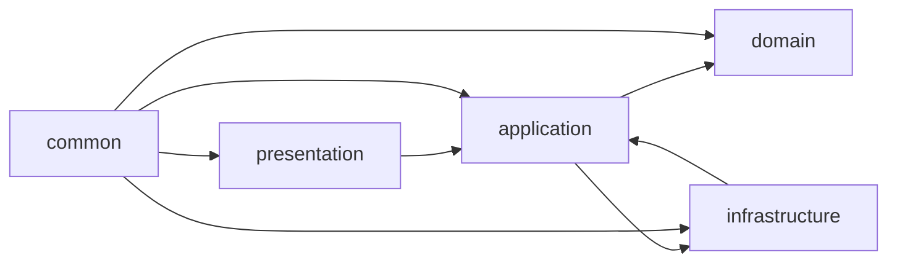

# Arquitetura n-Layer + Clean Architecture

Este README descreve a arquitetura híbrida que combina o padrão **n-Layer** (camadas Presentation, Service, Repository) com os princípios da **Clean Architecture** (Entities, Use Cases, Interface Adapters, Frameworks & Drivers) aplicados em um projeto Spring Boot.

---
# Visão Geral da API
Esta API faz parte de uma plataforma web cujo objetivo é permitir que alunos cadastrem, editem e compartilhem projetos acadêmicos de forma simples, centralizada e acessível. Os usuários podem criar perfis, registrar projetos com detalhes relevantes (descrição, links, integrantes, status público/privado) e visualizar tanto seus próprios projetos quanto os de colegas. Além disso, empresas externas interessadas podem acessar e investir nesses projetos. O acesso ao sistema acontece por meio de uma landing page, que disponibiliza tanto o repositório principal (a plataforma em si) quanto o Lab Maker e a Biblioteca Maker.

---
## Estrutura de Pastas

```bash
src/
├─ main/
│  ├─ java/com/exemplo/meuapp/
│  │  ├─ presentation/           # API REST, Controllers e DTOs
│  │  ├─ application/            # Serviços (Use Cases) e Portas In/Out
│  │  ├─ domain/                 # Entidades, Value Objects e Exceções de Domínio
│  │  ├─ infrastructure/         # Configurações, Repositórios e Clientes externos
│  │  └─ common/                 # Utilitários, mappers e constantes
│  └─ resources/
│     ├─ application.yml         # Configurações do Spring Boot
│     ├─ static/                 # Arquivos estáticos (CSS, JS, imagens)
│     └─ db/                     # Scripts de banco de dados
└─ test/
   └─ java/com/exemplo/meuapp/   # Testes por camada (Controllers, Services, Repository)
```

---

## Camadas e Papéis

### 1. presentation
- **Controllers**: expõem endpoints REST e recebem requisições HTTP.
- **DTOs**: objetos de transferência que isolam a API da lógica interna.
- **Handlers de Exceção**: mapeiam erros para respostas apropriadas.

### 2. application
- **Use Cases (Services)**: implementam regras de orquestração de negócio.
- **Portas de Entrada (in)**: interfaces que definem os métodos disponíveis à camada presentation.
- **Portas de Saída (out)**: interfaces (gateways) para dependências externas (por ex. banco de dados).

### 3. domain
- **Entidades**: classes que representam o modelo de negócio (e.g., `Cliente`, `Pedido`).
- **Value Objects**: tipos que carregam valor e regras (e.g., `Email`, `CPF`).
- **Exceções de Domínio**: erros específicos de regras de negócio.

### 4. infrastructure
- **Config**: beans do Spring, segurança, datasource, etc.
- **Persistence**: implementação de `application.port.out` via Spring Data JPA.
- **Entities JPA**: classes anotadas com JPA para mapear o banco.
- **WebClient/RestTemplate**: clientes HTTP para APIs externas.

### 5. common
- **Utilitários**: helpers, constantes e mapeadores (`ModelMapper`, MapStruct, etc.).
- **Cross-Cutting**: código compartilhado que não pertence a uma camada específica.

---

## Fluxo de Dependências



> **Regra de ouro**: dependências sempre apontam para dentro. Camadas externas referenciam apenas interfaces definidas internamente.

---

## Benefícios

- **Baixo acoplamento**: mudanças na infraestrutura não afetam o núcleo de negócio.
- **Testeabilidade**: cada camada pode ser testada isoladamente usando mocks das portas.
- **Manutenibilidade**: código organizado e responsabilidades claras.
- **Evolução**: troca de frameworks ou bibliotecas sem impactar a lógica central.

---

## Como Usar

1. **Clone** este repositório.
2. **Abra** no seu IDE favorito (IntelliJ, Eclipse).
3. **Execute** `mvn clean install` para compilar.
4. **Inicie** com `mvn spring-boot:run`.

---

## Licença

MIT © Seu Nome
