# 🚀 SENAI API - Plataforma de Projetos Acadêmicos

<div align="center">
  
  
  
  
  
  
</div>

---

## 📋 Sobre o Projeto

Esta API RESTful faz parte de uma **plataforma web educacional** do SENAI que permite aos alunos:

- 📝 **Cadastrar e gerenciar projetos acadêmicos**
- 🔗 **Compartilhar projetos com links e recursos**
- 👥 **Colaborar com outros alunos**
- 🏢 **Atrair investimento de empresas**
- 🎯 **Controlar visibilidade** (público/privado)
- 🔐 **Autenticação via Google OAuth2**

### 🏗️ Arquitetura

Implementa uma **arquitetura híbrida** combinando:

- **n-Layer Architecture** (Presentation, Service, Repository)
- **Clean Architecture** (Entities, Use Cases, Interface Adapters)
- **Hexagonal Architecture** (Ports & Adapters)

---

## 🛠️ Tecnologias Utilizadas

| Categoria           | Tecnologia               | Versão  |
| ------------------- | ------------------------ | ------- |
| **Backend**         | Java                     | 21      |
| **Framework**       | Spring Boot              | 3.1.2   |
| **Build Tool**      | Maven                    | 3.9.5   |
| **ORM**             | Hibernate/JPA            | 6.2.6   |
| **Database**        | PostgreSQL               | Latest  |
| **Security**        | Spring Security + OAuth2 | 3.1.2   |
| **Documentation**   | MapStruct                | 1.5.3   |
| **Code Generation** | Lombok                   | 1.18.34 |

---

## 📁 Estrutura do Projeto

## 📁 Estrutura do Projeto

```bash
📦 SENAI-API/
├── 📁 .vscode/               # VS Code configurations
│   ├── tasks.json           # Tasks pré-configuradas do Maven
│   ├── extensions.json      # Extensões recomendadas
│   └── settings.json        # Configurações do workspace
├── 📁 database/             # Scripts de banco de dados
│   └── 📁 seeds/            # Scripts SQL organizados
│       ├── 01_cursos.sql
│       ├── 02_enderecos.sql
│       ├── 03_usuarios.sql
│       ├── 04_professores.sql
│       ├── 05_alunos.sql
│       ├── 06_unidades_curriculares.sql
│       ├── 07_disciplinas.sql
│       ├── 08_projetos.sql
│       ├── 09_etapas_projetos.sql
│       ├── 10_relacionamentos.sql
│       ├── 11_anexos.sql
│       ├── clean_database.sql
│       └── run_all_seeds.sql
├── 📁 docs/                 # Documentação
│   ├── architecture.md      # Arquitetura do sistema
│   └── vscode-setup.md      # Guia de configuração VS Code
├── 📁 src/
│   └── 📁 main/
│       ├── 📁 java/com/exemplo/meuapp/
│       │   ├── Main.java            # 🚀 Classe principal Spring Boot
│       │   ├── 📁 presentation/     # 🌐 REST Controllers & DTOs
│       │   ├── 📁 application/      # ⚙️ Use Cases & Business Logic
│       │   │   ├── 📁 port/         # Interfaces (Ports)
│       │   │   └── 📁 service/      # Implementações de serviços
│       │   ├── 📁 domain/           # 🎯 Entities & Business Rules
│       │   │   ├── 📁 model/        # Entidades de domínio
│       │   │   ├── 📁 enums/        # Enumerações
│       │   │   └── 📁 exception/    # Exceções customizadas
│       │   ├── 📁 infrastructure/   # 🔧 Database & External APIs
│       │   │   ├── 📁 config/       # Configurações
│       │   │   ├── 📁 persistence/  # Repositórios JPA
│       │   │   └── 📁 webclient/    # Clientes externos
│       │   └── 📁 common/           # 🔄 Mappers & Utils
│       │       └── 📁 mapper/       # MapStruct mappers
│       └── 📁 resources/
│           ├── application.yml      # ⚙️ Configurações Spring Boot
│           ├── 📁 static/          # Arquivos estáticos
│           └── 📁 templates/        # Templates (se houver)
├── 📁 target/                # 🗂️ Build output (Maven - ignorado pelo Git)
├── .gitignore               # 🚫 Regras do Git
├── mvnw                     # 🔧 Maven Wrapper (Unix/Linux/Mac)
├── mvnw.cmd                # 🔧 Maven Wrapper (Windows)
├── pom.xml                 # 📋 Dependências e configurações Maven
└── README.md               # 📖 Este arquivo
```

---

## ⚡ Quick Start

### 🔧 Pré-requisitos

- ☕ **Java 21** ou superior ([Download JDK](https://adoptium.net/))
- 🎯 **VS Code** ([Download](https://code.visualstudio.com/))
- 🐘 **PostgreSQL** (configurado para conexão externa)

### 🚀 Executando o Projeto

#### Opção 1: Via Tasks do VS Code (Recomendado)

1. Abra o projeto no VS Code
2. Pressione `Ctrl + Shift + P`
3. Digite "Tasks: Run Task"
4. Selecione "🚀 Spring Boot Run"

#### Opção 2: Via Maven Wrapper

```bash
# Clone o repositório
git clone <repository-url>
cd SENAI-API

# Execute o projeto
./mvnw spring-boot:run

# No Windows PowerShell:
.\mvnw.cmd spring-boot:run
```

#### Opção 3: Via Terminal Integrado

```bash
# No terminal do VS Code
./mvnw spring-boot:run
```

#### ⚠️ **IMPORTANTE - NÃO use o botão "Play"**

- O botão "▶️ Play" do VS Code **NÃO funcionará** para este projeto
- Spring Boot precisa das dependências do Maven para executar
- Use sempre as **Tasks configuradas** ou o **Maven Wrapper**

### 🌐 Acessando a Aplicação

Após iniciar, a aplicação estará disponível em:

- **URL**: `http://localhost:8080`
- **📚 Swagger UI**: `http://localhost:8080/swagger-ui.html` ⭐
- **📋 OpenAPI JSON**: `http://localhost:8080/api-docs`
- **📄 OpenAPI YAML**: `http://localhost:8080/api-docs.yaml`
- **❤️ Health Check**: `http://localhost:8080/api/v1/demo/health`

---

## 📚 Documentação da API (Swagger)

### 🎯 **O que é o Swagger?**

O **Swagger** (agora **OpenAPI 3**) é uma ferramenta que gera automaticamente:

- 📖 **Documentação interativa** da sua API
- 🧪 **Interface de testes** para todos os endpoints
- 📋 **Especificação OpenAPI** em JSON/YAML
- 🔄 **Geração de clientes** em várias linguagens

### 🚀 **Como acessar:**

1. **Execute a aplicação**:

   ```bash
   ./mvnw spring-boot:run
   ```

2. **Abra o Swagger UI** no navegador:
   ```
   http://localhost:8080/swagger-ui.html
   ```

### 🎨 **Funcionalidades do Swagger UI:**

- **📖 Documentação automática** de todos os endpoints
- **🧪 Teste direto** dos endpoints no navegador
- **📋 Esquemas** de request/response
- **🔒 Autenticação JWT** integrada
- **📱 Responsivo** para mobile/desktop
- **🎨 Interface moderna** e intuitiva

### 🛠️ **Configurações aplicadas:**

```yaml
# application.yml
springdoc:
  api-docs:
    enabled: true
    path: /api-docs
  swagger-ui:
    enabled: true
    path: /swagger-ui.html
    operationsSorter: method
    tagsSorter: alpha
    tryItOutEnabled: true
    filter: true
    syntaxHighlight:
      theme: monokai
```

### 📝 **Endpoints de Demonstração:**

| Método | Endpoint                     | Descrição                |
| ------ | ---------------------------- | ------------------------ |
| `GET`  | `/api/v1/demo/health`        | ❤️ Health check da API   |
| `GET`  | `/api/v1/demo/projetos`      | 📋 Listar projetos       |
| `POST` | `/api/v1/demo/projetos`      | ➕ Criar projeto         |
| `GET`  | `/api/v1/demo/projetos/{id}` | 🔍 Buscar projeto por ID |

### 🔧 **Testando no Swagger:**

1. Acesse `http://localhost:8080/swagger-ui.html`
2. Expanda um endpoint (ex: `GET /api/v1/demo/projetos`)
3. Clique em **"Try it out"**
4. Clique em **"Execute"**
5. Veja a resposta em tempo real! 🎉

---

## 🎯 Funcionalidades da API

### 👤 Gestão de Usuários

- ✅ Cadastro e autenticação
- ✅ OAuth2 (Google, GitHub)
- ✅ Perfis de Aluno/Professor/Admin

### 📂 Gestão de Projetos

- ✅ CRUD completo de projetos
- ✅ Upload de anexos
- ✅ Controle de visibilidade
- ✅ Colaboração entre alunos

### 🏢 Módulo Empresas

- ✅ Visualização de projetos públicos
- ✅ Sistema de investimento
- ✅ Contato com desenvolvedores

---

## 🔧 Configuração do VS Code

### 📥 Extensões Essenciais

O projeto inclui configuração automática para VS Code. As extensões serão sugeridas automaticamente:

```json
{
  "recommendations": [
    "vscjava.vscode-java-pack",
    "vscjava.vscode-lombok",
    "redhat.vscode-xml",
    "pivotal.vscode-spring-boot",
    "ms-vscode.vscode-json"
  ]
}
```

### ⚙️ Configurações do Workspace

Configurações otimizadas incluídas em `.vscode/settings.json`:

- Auto-organização de imports
- Formatação automática
- Configurações do Java
- Debug configurations

### 🐛 Debug Configuration

Configuração de debug pré-configurada em `.vscode/launch.json`:

- Debug da aplicação Spring Boot
- Hot reload ativado
- Perfis de ambiente

---

## 🗃️ Banco de Dados

### 🐘 PostgreSQL (Produção)

```yaml
spring:
  datasource:
    url: "jdbc:postgresql://147.79.86.117:10103/senai"
    username: postgres
    password: "DUdu@147"
    driver-class-name: org.postgresql.Driver
  jpa:
    hibernate:
      ddl-auto: update
    show-sql: false
```

### 🔐 OAuth2 Configuration

```yaml
spring:
  security:
    oauth2:
      client:
        registration:
          google:
            client-id: 566612538072-lt6fo1kk28mnmrsfbhqtlvc4kpqv97vh.apps.googleusercontent.com
            client-secret: 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
            scope:
              - openid
              - profile
              - email
```

### 📊 Scripts de Banco Disponíveis

O projeto inclui scripts SQL organizados em `database/seeds/`:

- `01_cursos.sql` - Estrutura de cursos
- `02_enderecos.sql` - Dados de endereços
- `03_usuarios.sql` - Usuários do sistema
- `04_professores.sql` - Dados de professores
- `05_alunos.sql` - Dados de alunos
- `06_unidades_curriculares.sql` - Unidades curriculares
- `07_disciplinas.sql` - Disciplinas
- `08_projetos.sql` - Projetos acadêmicos
- `09_etapas_projetos.sql` - Etapas dos projetos
- `10_relacionamentos.sql` - Relacionamentos entre entidades
- `11_anexos.sql` - Anexos dos projetos

---

## 🏗️ Arquitetura Detalhada

### 📊 Fluxo de Dependências

```mermaid
graph TB
    subgraph "🌐 Presentation Layer"
        A[Controllers] --> B[DTOs]
    end

    subgraph "⚙️ Application Layer"
        C[Use Cases] --> D[Ports In]
        C --> E[Ports Out]
    end

    subgraph "🎯 Domain Layer"
        F[Entities] --> G[Value Objects]
        F --> H[Domain Rules]
    end

    subgraph "🔧 Infrastructure Layer"
        I[Repositories] --> J[Database]
        K[External APIs] --> L[Web Clients]
    end

    A --> C
    C --> F
    E --> I
    E --> K
```



### 🧩 Padrões Implementados

- **🔌 Ports & Adapters**: Isolamento de dependências externas
- **📦 Repository Pattern**: Abstração de acesso a dados
- **🎯 Use Cases**: Lógica de negócio isolada
- **🔄 DTO Pattern**: Transferência de dados segura
- **🛡️ Exception Handling**: Tratamento centralizado de erros

---

## 🧪 Testes

### 🏃‍♂️ Executando Testes

```bash
# Todos os testes
./mvnw test

# Testes específicos
./mvnw test -Dtest=UsuariosControllerTest

# Com coverage
./mvnw test jacoco:report
```

### 📊 Estrutura de Testes

```bash
📁 src/test/java/
├── 📁 presentation/     # Controller tests
├── 📁 application/      # Use case tests
├── 📁 domain/          # Domain logic tests
└── 📁 infrastructure/   # Repository tests
```

---

## 🚀 Deploy

### 🐳 Docker (Em breve)

```dockerfile
# Dockerfile incluído no projeto
FROM openjdk:21-jre-slim
COPY target/senai-api.jar app.jar
EXPOSE 8080
ENTRYPOINT ["java", "-jar", "/app.jar"]
```

### ☁️ Cloud Ready

- ✅ **Profiles** configurados (dev, test, prod)
- ✅ **Environment Variables** suportadas
- ✅ **Health Checks** implementados
- ✅ **Metrics** via Actuator

---

## 🛠️ Tasks Disponíveis no VS Code

Este projeto inclui tasks pré-configuradas para facilitar o desenvolvimento:

| Task                   | Comando                            | Descrição                |
| ---------------------- | ---------------------------------- | ------------------------ |
| 🧹 **Maven Clean**     | `./mvnw clean`                     | Limpa o diretório target |
| 🔨 **Maven Compile**   | `./mvnw compile`                   | Compila o código fonte   |
| 🧪 **Maven Test**      | `./mvnw test`                      | Executa os testes        |
| 🚀 **Spring Boot Run** | `./mvnw spring-boot:run`           | Inicia a aplicação       |
| 📦 **Maven Package**   | `./mvnw clean package -DskipTests` | Gera o JAR               |
| 🔍 **Maven Verify**    | `./mvnw verify`                    | Verifica o projeto       |

### 🎯 Como usar as Tasks:

1. Pressione `Ctrl + Shift + P`
2. Digite "Tasks: Run Task"
3. Selecione a task desejada

---

## 🛠️ Scripts Úteis

### 📋 Comandos Maven

```bash
# Limpar build
./mvnw clean

# Compilar apenas
./mvnw compile

# Executar testes
./mvnw test

# Gerar JAR
./mvnw package

# Pular testes
./mvnw package -DskipTests

# Executar aplicação
./mvnw spring-boot:run

# Debug mode
./mvnw spring-boot:run -Dspring-boot.run.jvmArguments="-Xdebug -Xrunjdwp:transport=dt_socket,server=y,suspend=n,address=5005"
```

### 🔧 Desenvolvimento

```bash
# Hot reload (via Spring DevTools)
./mvnw spring-boot:run -Dspring-boot.run.profiles=dev

# Gerar classes MapStruct
./mvnw compile

# Validar código
./mvnw checkstyle:check
```

---

## ❗ Solução de Problemas Comuns

### 🚫 **Erro: "package org.springframework.boot does not exist"**

**Problema**: Você tentou usar o botão "▶️ Play" no arquivo `Main.java`

**Solução**:

```bash
# ❌ NÃO FAÇA ISSO:
# Apertar o botão "Play" no Main.java

# ✅ FAÇA ISSO:
# Use as tasks do VS Code ou Maven Wrapper
./mvnw spring-boot:run
```

**Por que acontece?**

- O botão "Play" tenta executar apenas o arquivo Java isoladamente
- Spring Boot precisa de todas as dependências do Maven
- Use sempre as tasks configuradas no projeto

### 🔌 **Erro de Conexão com Banco**

**Problema**: Erro ao conectar com PostgreSQL

**Verificações**:

1. ✅ PostgreSQL está rodando?
2. ✅ Host `147.79.86.117:10103` está acessível?
3. ✅ Credenciais estão corretas no `application.yml`?

### 🚀 **Porta 8080 em uso**

**Problema**: `Port 8080 was already in use`

**Solução**:

```bash
# Verificar processos na porta 8080
netstat -ano | findstr :8080

# Matar processo (Windows)
taskkill /F /PID <PID_NUMBER>

# Ou usar outra porta
./mvnw spring-boot:run -Dserver.port=8081
```

### 🔧 **Maven Wrapper não funciona**

**Problema**: `./mvnw: command not found`

**Solução Windows PowerShell**:

```powershell
# Use a versão Windows
.\mvnw.cmd spring-boot:run
```

**Solução Git Bash**:

```bash
# Dar permissão de execução
chmod +x mvnw
./mvnw spring-boot:run
```

---

## 📚 Documentação Adicional

- 📖 **[Setup VS Code](./docs/vscode-setup.md)** - Guia completo de configuração
- 🏗️ **[Arquitetura](./docs/architecture.md)** - Detalhes da arquitetura
- 🔐 **[Segurança](./docs/security.md)** - Configurações de segurança
- 🗃️ **[Database](./docs/database.md)** - Esquemas e migrações

---

## 🤝 Contribuição

1. 🍴 Fork o projeto
2. 🌟 Crie uma branch: `git checkout -b feature/nova-funcionalidade`
3. 💻 Commit suas mudanças: `git commit -m 'Add: nova funcionalidade'`
4. 📤 Push para branch: `git push origin feature/nova-funcionalidade`
5. 🔄 Abra um Pull Request

### 📝 Padrões de Commit

```bash
feat: nova funcionalidade
fix: correção de bug
docs: atualização de documentação
style: formatação de código
refactor: refatoração
test: adição de testes
chore: tarefas de build/configuração
```

---

## 📞 Suporte

- 📧 **Email**: suporte@senai.br
- 💬 **Teams**: Canal #senai-api-dev
- 📖 **Wiki**: [Confluence SENAI](https://senai.atlassian.net)

---

## 📄 Licença

```
© 2025 SENAI - Serviço Nacional de Aprendizagem Industrial
Todos os direitos reservados.

Este projeto é propriedade do SENAI e destina-se exclusivamente
para fins educacionais e de desenvolvimento acadêmico.

Última atualização: Junho 2025
Versão da API: 0.0.1-SNAPSHOT
```

---

<div align="center">
  <p>Desenvolvido com ❤️ pelo time SENAI</p>
  <p>
    <a href="#-sobre-o-projeto">Sobre</a> •
    <a href="#-quick-start">Quick Start</a> •
    <a href="#-arquitetura-detalhada">Arquitetura</a> •
    <a href="#-contribuição">Contribuição</a>
  </p>
</div>
