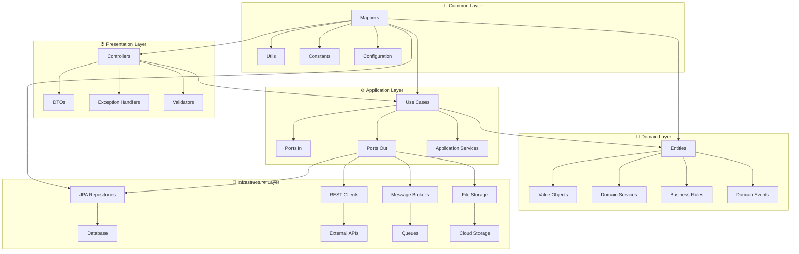
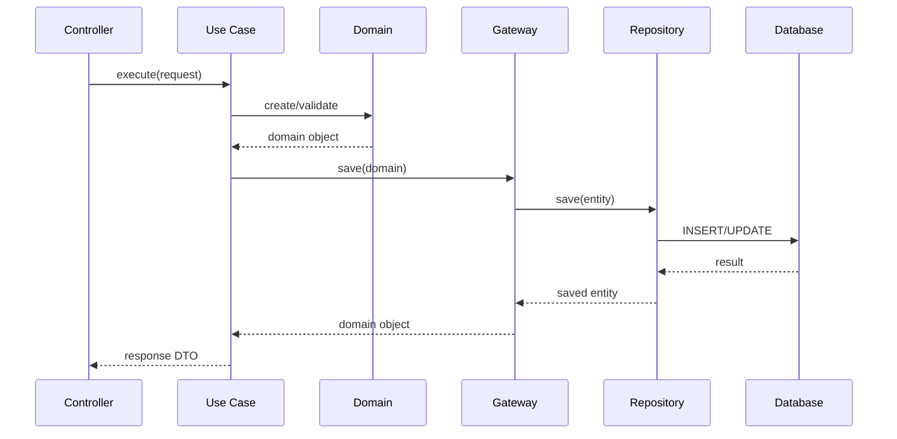

# 🏗️ Arquitetura SENAI API

## 📋 Visão Geral

Esta API implementa uma **arquitetura híbrida** que combina os melhores aspectos de diferentes padrões arquiteturais:

- **🎯 Clean Architecture** (Uncle Bob)
- **🔷 Hexagonal Architecture** (Ports & Adapters)
- **📊 n-Layer Architecture** (Tradicional)

---

## 🏛️ Princípios Fundamentais

### 1. 🎯 **Inversão de Dependência**
```
Camadas externas → dependem de → Camadas internas
```

### 2. 🔌 **Ports & Adapters**
```
Core Business Logic ←→ Ports ←→ Adapters ←→ External World
```

### 3. 📦 **Separação de Responsabilidades**
```
Presentation → Application → Domain ← Infrastructure
```

---

## 📁 Estrutura Detalhada



---

## 🧩 Camadas e Responsabilidades

### 🌐 **1. Presentation Layer**

**📍 Localização**: `src/main/java/com/exemplo/meuapp/presentation/`

**🎯 Responsabilidades**:
- Receber requisições HTTP
- Validar entrada de dados
- Converter entre DTOs e Domain Objects
- Retornar respostas HTTP apropriadas
- Tratar exceções da aplicação

**📦 Componentes**:
```java
presentation/
├── controller/          # REST Controllers
│   ├── AlunosController.java
│   ├── ProjetosController.java
│   └── UsuariosController.java
├── dto/                # Data Transfer Objects
│   ├── request/        # DTOs de entrada
│   └── response/       # DTOs de saída
└── handler/            # Exception Handlers
    └── GlobalExceptionHandler.java
```

**🔄 Fluxo de Dados**:
```
HTTP Request → Controller → DTO → Use Case → Domain → Response DTO → HTTP Response
```

---

### ⚙️ **2. Application Layer**

**📍 Localização**: `src/main/java/com/exemplo/meuapp/application/`

**🎯 Responsabilidades**:
- Orquestrar lógica de negócio
- Coordenar entre diferentes domínios
- Gerenciar transações
- Implementar casos de uso
- Definir contratos (Ports)

**📦 Componentes**:
```java
application/
├── port/
│   ├── in/             # Portas de entrada (Use Cases)
│   │   ├── alunos/
│   │   ├── projetos/
│   │   └── usuarios/
│   └── out/            # Portas de saída (Gateways)
│       ├── AlunosGateway.java
│       ├── ProjetosGateway.java
│       └── EmailGateway.java
└── service/            # Implementação dos Use Cases
    ├── AlunosService.java
    ├── ProjetosService.java
    └── UsuariosService.java
```

**🔄 Padrão de Use Case**:
```java
@Service
@RequiredArgsConstructor
@Transactional
public class CriarProjetoUseCase {
    
    private final ProjetosGateway projetosGateway;
    private final UsuariosGateway usuariosGateway;
    private final EmailGateway emailGateway;
    
    public ProjetoResponse execute(CriarProjetoRequest request) {
        // 1. Validar entrada
        validarRequest(request);
        
        // 2. Buscar dados necessários
        Usuario autor = usuariosGateway.findById(request.getAutorId());
        
        // 3. Aplicar regras de negócio
        Projeto projeto = Projeto.criar(request.getNome(), autor);
        
        // 4. Persistir
        Projeto projetoSalvo = projetosGateway.save(projeto);
        
        // 5. Efeitos colaterais (eventos, notificações)
        emailGateway.enviarNotificacao(autor.getEmail(), "Projeto criado");
        
        // 6. Retornar resultado
        return ProjetoMapper.toResponse(projetoSalvo);
    }
}
```

---

### 🎯 **3. Domain Layer**

**📍 Localização**: `src/main/java/com/exemplo/meuapp/domain/`

**🎯 Responsabilidades**:
- Conter regras de negócio puras
- Definir entidades e value objects
- Implementar invariantes de domínio
- Gerenciar eventos de domínio
- Ser independente de frameworks

**📦 Componentes**:
```java
domain/
├── model/              # Entidades de domínio
│   ├── Aluno.java
│   ├── Projeto.java
│   ├── Usuario.java
│   └── valueobjects/   # Value Objects
│       ├── Email.java
│       ├── CPF.java
│       └── StatusProjeto.java
├── enums/              # Enumerações
│   ├── TipoProjeto.java
│   ├── StatusAluno.java
│   └── PerfilUsuario.java
├── exception/          # Exceções de domínio
│   ├── ProjetoNotFoundException.java
│   ├── AlunoInvalidoException.java
│   └── BusinessRuleException.java
└── event/              # Eventos de domínio
    ├── ProjetoCriadoEvent.java
    └── AlunoMatriculadoEvent.java
```

**🎯 Exemplo de Entidade de Domínio**:
```java
@Entity
@Table(name = "projetos")
@Data
@Builder
@NoArgsConstructor
@AllArgsConstructor
public class Projeto {
    
    @Id
    @GeneratedValue(strategy = GenerationType.UUID)
    private UUID uuid;
    
    @Column(nullable = false)
    private String nome;
    
    @Enumerated(EnumType.STRING)
    private StatusProjeto status;
    
    @ManyToOne
    private Usuario autor;
    
    // Método de fábrica com regras de negócio
    public static Projeto criar(String nome, Usuario autor) {
        validarNome(nome);
        validarAutor(autor);
        
        return Projeto.builder()
                .nome(nome)
                .autor(autor)
                .status(StatusProjeto.RASCUNHO)
                .build();
    }
    
    // Regras de negócio
    public void publicar() {
        if (status != StatusProjeto.RASCUNHO) {
            throw new BusinessRuleException("Apenas projetos em rascunho podem ser publicados");
        }
        this.status = StatusProjeto.PUBLICADO;
    }
    
    private static void validarNome(String nome) {
        if (StringUtils.isBlank(nome)) {
            throw new IllegalArgumentException("Nome do projeto é obrigatório");
        }
        if (nome.length() > 100) {
            throw new IllegalArgumentException("Nome do projeto deve ter no máximo 100 caracteres");
        }
    }
}
```

---

### 🔧 **4. Infrastructure Layer**

**📍 Localização**: `src/main/java/com/exemplo/meuapp/infrastructure/`

**🎯 Responsabilidades**:
- Implementar portas de saída (Gateways)
- Integrar com banco de dados
- Conectar com APIs externas
- Configurar frameworks
- Gerenciar aspectos técnicos

**📦 Componentes**:
```java
infrastructure/
├── config/             # Configurações
│   ├── DatabaseConfig.java
│   ├── SecurityConfig.java
│   └── SwaggerConfig.java
├── persistence/        # Implementação de persistência
│   ├── repository/     # Repositories JPA
│   │   ├── AlunosJpaRepository.java
│   │   └── ProjetosJpaRepository.java
│   ├── entity/         # Entidades JPA (se diferentes do Domain)
│   └── gateway/        # Implementação dos Gateways
│       ├── AlunosGatewayImpl.java
│       └── ProjetosGatewayImpl.java
└── webclient/          # Clientes externos
    ├── EmailServiceClient.java
    └── FileStorageClient.java
```

**🔄 Implementação de Gateway**:
```java
@Component
@RequiredArgsConstructor
public class ProjetosGatewayImpl implements ProjetosGateway {
    
    private final ProjetosJpaRepository repository;
    private final ProjetoMapper mapper;
    
    @Override
    public Projeto save(Projeto projeto) {
        ProjetoEntity entity = mapper.toEntity(projeto);
        ProjetoEntity savedEntity = repository.save(entity);
        return mapper.toDomain(savedEntity);
    }
    
    @Override
    public Optional<Projeto> findById(UUID id) {
        return repository.findById(id)
                .map(mapper::toDomain);
    }
    
    @Override
    public List<Projeto> findByAutor(UUID autorId) {
        return repository.findByAutorUuid(autorId)
                .stream()
                .map(mapper::toDomain)
                .collect(Collectors.toList());
    }
}
```

---

### 🔄 **5. Common Layer**

**📍 Localização**: `src/main/java/com/exemplo/meuapp/common/`

**🎯 Responsabilidades**:
- Fornecer utilitários compartilhados
- Implementar mappers entre camadas
- Definir constantes da aplicação
- Configurações cross-cutting

**📦 Componentes**:
```java
common/
├── mapper/             # Mappers MapStruct
│   ├── AlunosMapper.java
│   ├── ProjetosMapper.java
│   └── BaseMapper.java
├── util/               # Utilitários
│   ├── DateUtils.java
│   ├── StringUtils.java
│   └── ValidationUtils.java
├── constants/          # Constantes
│   ├── ApiConstants.java
│   └── ErrorMessages.java
└── config/             # Configurações compartilhadas
    └── CommonConfig.java
```

---

## 🔄 Fluxo de Dados Completo



---

## 🛡️ Benefícios da Arquitetura

### 1. **🔒 Isolamento de Responsabilidades**
- Cada camada tem uma responsabilidade específica
- Mudanças em uma camada não afetam outras
- Facilita manutenção e evolução

### 2. **🧪 Testabilidade**
- Domain Layer 100% testável (sem dependências)
- Use Cases testáveis com mocks
- Cada camada pode ser testada isoladamente

### 3. **🔄 Flexibilidade**
- Troca de banco de dados sem afetar business logic
- Mudança de framework web sem impacto no domínio
- Adição de novos casos de uso simplificada

### 4. **📈 Escalabilidade**
- Separação clara facilita divisão em microserviços
- Cada camada pode ser otimizada independentemente
- Suporte a diferentes padrões de acesso

---

## 📋 Regras de Implementação

### ✅ **O que FAZER**

1. **Domain sempre independente**:
   ```java
   // ✅ BOM - Sem dependências externas
   public class Projeto {
       public void publicar() {
           if (!podeSerPublicado()) {
               throw new BusinessRuleException("Não pode ser publicado");
           }
       }
   }
   ```

2. **Use Cases orquestram, não implementam regras**:
   ```java
   // ✅ BOM - Orquestra e delega
   public class PublicarProjetoUseCase {
       public void execute(UUID projetoId) {
           Projeto projeto = gateway.findById(projetoId);
           projeto.publicar(); // Regra no domínio
           gateway.save(projeto);
       }
   }
   ```

3. **Gateways abstraem implementação**:
   ```java
   // ✅ BOM - Interface no Application, implementação na Infrastructure
   public interface ProjetosGateway {
       Projeto save(Projeto projeto);
       Optional<Projeto> findById(UUID id);
   }
   ```

### ❌ **O que NÃO fazer**

1. **Domain dependendo de frameworks**:
   ```java
   // ❌ RUIM - Domain não deve conhecer JPA
   @Entity // ❌ Annotation de framework
   public class Projeto {
       @Autowired // ❌ Injection no domain
       private ProjetosRepository repository;
   }
   ```

2. **Controllers com lógica de negócio**:
   ```java
   // ❌ RUIM - Lógica no controller
   @PostMapping
   public ResponseEntity<?> criar(@RequestBody ProjetoDTO dto) {
       if (dto.getNome().length() > 100) { // ❌ Regra aqui
           return ResponseEntity.badRequest().build();
       }
   }
   ```

3. **Use Cases acessando banco diretamente**:
   ```java
   // ❌ RUIM - Use Case conhecendo implementação
   @Service
   public class CriarProjetoUseCase {
       @Autowired
       private ProjetosJpaRepository repository; // ❌ Dependência direta
   }
   ```

---

## 🧪 Estratégia de Testes

### 🎯 **Domain Layer**
```java
// Testes unitários puros - sem frameworks
class ProjetoTest {
    @Test
    void devePublicarQuandoEmRascunho() {
        // Given
        Projeto projeto = Projeto.criar("Nome", autor);
        
        // When
        projeto.publicar();
        
        // Then
        assertThat(projeto.getStatus()).isEqualTo(StatusProjeto.PUBLICADO);
    }
}
```

### ⚙️ **Application Layer**
```java
// Testes com mocks dos gateways
@ExtendWith(MockitoExtension.class)
class PublicarProjetoUseCaseTest {
    @Mock ProjetosGateway gateway;
    @InjectMocks PublicarProjetoUseCase useCase;
    
    @Test
    void devePublicarProjeto() {
        // Given
        when(gateway.findById(any())).thenReturn(projetoRascunho);
        
        // When
        useCase.execute(projetoId);
        
        // Then
        verify(gateway).save(argThat(p -> p.getStatus() == PUBLICADO));
    }
}
```

### 🌐 **Presentation Layer**
```java
// Testes de integração com MockMvc
@WebMvcTest(ProjetosController.class)
class ProjetosControllerTest {
    @MockBean PublicarProjetoUseCase useCase;
    
    @Test
    void devePublicarProjeto() throws Exception {
        mockMvc.perform(post("/api/v1/projetos/{id}/publicar", projetoId))
               .andExpect(status().isOk());
    }
}
```

---

## 📚 Referências

- 📖 **Clean Architecture** - Uncle Bob Martin
- 🔷 **Hexagonal Architecture** - Alistair Cockburn  
- 🏗️ **Domain-Driven Design** - Eric Evans
- 🌿 **Spring Boot Documentation**
- 📋 **SOLID Principles**

---

<div align="center">
  <p>🏗️ <strong>Arquitetura é sobre decisões que são difíceis de mudar!</strong> 🏗️</p>
  <p>Desenvolvido com ❤️ pelo time SENAI</p>
</div>
